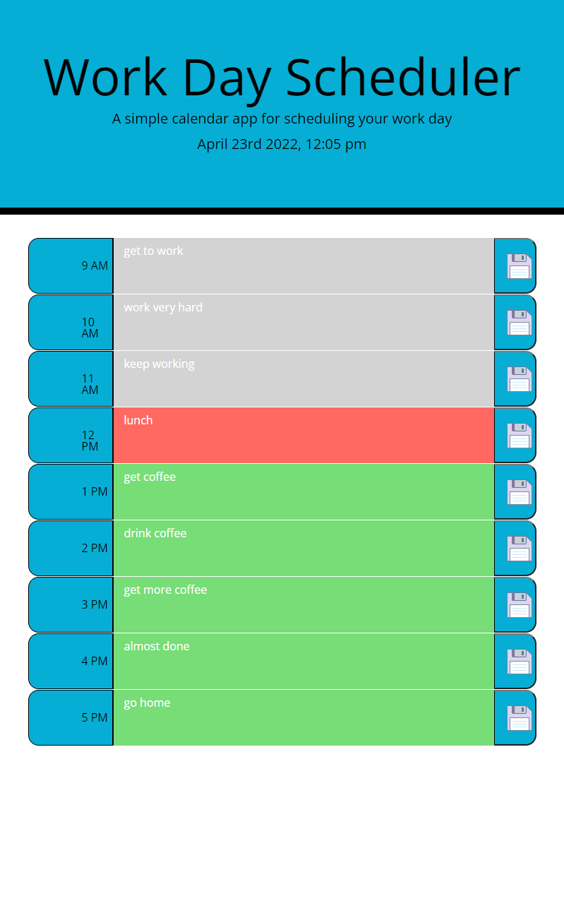

# Work Day Scheduler Starter Code

## **Description**

1. I started this project by hardcoding the time slots in html.

2. After this was done I turned to javascript to make it functional.
   
    1. First I set my attention on using moment.js to set the current date and time at the top of the page.

    2. Next I setup my time variables to be compared within a for loop.

    3. In the for loop I used conditional if/else to decide if the text areas should be past, present, or future for the proper colors to be displayed.

    4. Then I added and event listener to my save buttons at each index to store the text in the textarea at that index to localStorage.

    5.  Finally outside of the for loop I created variables to get the text saved in localStorage and put it into the text area as textContent.

## **Screenshot**

## **Link to Page and Repository**

Page: https://jordanio49.github.io/work-day-schedule/

Repository: https://github.com/Jordanio49/work-day-schedule